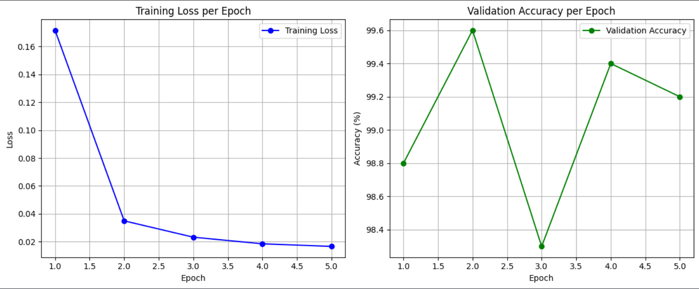

# 🧑‍🤝‍🧑 Real vs Synthetic Face Classification

## 📌 Overview
This project tackles the challenge of distinguishing **real human faces** from **synthetically generated ones** using deep learning.  
We trained a convolutional neural network (CNN) on a curated subset of real and AI-generated facial images.  
The model achieved **up to 99.6% validation accuracy** in just 5 epochs, demonstrating its strong ability to detect synthetic faces.

---

## 📂 Dataset

The dataset consists of two main subsets:

### 1. Real Face Images (FFHQ Subset)
- **Quantity:** 70,000 images  
- **Resolution:** 256×256 pixels  
- **Source:** [FFHQ via Kaggle](https://www.kaggle.com/c/deepfake-detection-challenge/discussion/122786)  
- **Description:** High-quality, diverse real faces with variations in age, ethnicity, and pose.  

### 2. Synthetic Face Images (Diffusion Model Generated)
- **Quantity:** 64,000 images  
- **Resolution:** 1024×1024 pixels  
- **Source:** [Synthetic Faces via Kaggle](https://www.kaggle.com/datasets/selfishgene/sfhq-t2i-synthetic-faces-from-text-2-image-models)  
- **Description:** AI-generated faces created using **Flux1.pro**, **Flux1.dev**, and **Stable Diffusion XL**.  

👉 For this experiment, only **5,000 images for training** and **1,000 images for testing** were used to keep training efficient.

---

## ⚙️ Model & Training

- **Framework:** PyTorch  
- **Image Size:** 224×224  
- **Batch Size:** 32  
- **Optimizer:** Adam  
- **Loss Function:** CrossEntropyLoss  
- **Device:** GPU (CUDA) / CPU  

The model was trained for **5 epochs**.

---

## 📊 Results

| Epoch | Training Loss | Validation Accuracy |
|-------|---------------|----------------------|
| 1     | 0.1717        | 98.80%              |
| 2     | 0.0349        | 99.60%              |
| 3     | 0.0231        | 98.30%              |
| 4     | 0.0184        | 99.40%              |
| 5     | 0.0165        | 99.20%              |

- Training loss consistently decreased across epochs.  
- Validation accuracy peaked at **99.6% (Epoch 2)**.  
- The model remained highly accurate (>98%) throughout training.

---

## 📈 Training Curves

**Training Loss vs Epoch** (left) and **Validation Accuracy vs Epoch** (right):  



---

## ✅ Key Takeaways
- The CNN achieved **near-perfect accuracy** in distinguishing real vs synthetic faces.  
- Even with a **small training subset**, the model generalized effectively.  
- Demonstrates the potential of deep learning for **deepfake detection**.  

---

## 🚀 Future Work
- Train on the **full dataset** for further robustness.  
- Experiment with **advanced architectures** (EfficientNet, Vision Transformers).  
- Evaluate across **other synthetic datasets** to test generalization.  
- Deploy as a **real-time detection API**.  

---

## 💻 Installation & Usage

### 1. Clone the Repository
```bash
git clone https://github.com/yourusername/real-vs-synthetic-faces.git
cd real-vs-synthetic-faces
